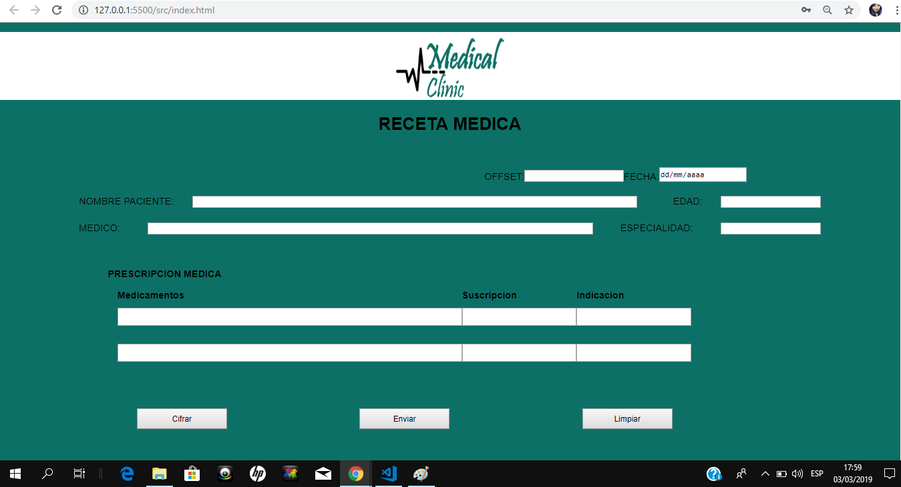
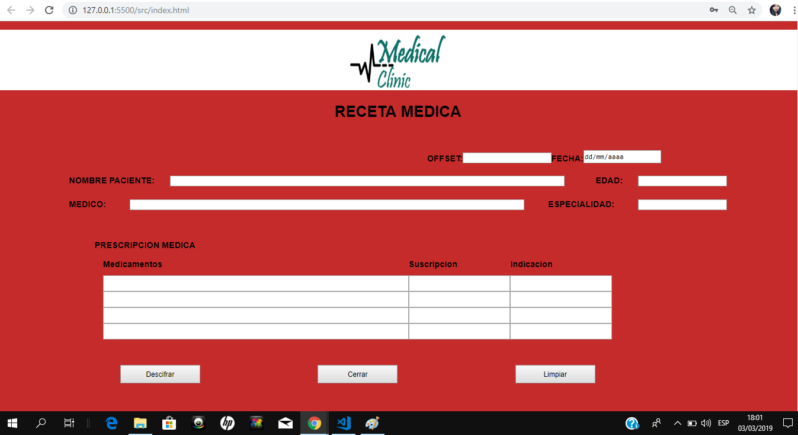

				##Medical Clinic Cipher

-cuéntanos cómo pensaste en los usuarios y cuál fue tu proceso para definir el producto final a nivel de  experiencia y de interfaz.

Medical clinic Cipher se crea en base a la necesidad de proteger la informacion que se maneja en los centros de salud y tambien en
el negocio Farmaceutico. 

Es por ello, que para proteger y generar mayor confianza al usuario principal (pacientes) a la hora de 
hacer una consulta medica y que se genere una receta medica sea mas seguro el compartir informacion no solo del paciente sino tambien
del contenido de una receta medica.

En la actualidad el sistema de Salud lamentablemente no es uno de los mejores, y ni que hablar del gran monopolio farmaceutico que no
genera la confianza necesaria a la hora de adquierir un producto farmaceutico asi tambien existe una gran cantidad de personas que 
intentan lucrar con la salud de los usuarios finales(pacientes).

En base a este gran problema y la necesidad que el usuario sienta confianza a la hora de obtener farmacos en una farmacia autorizada 
en donde no le vendan medicamentos vencidos o de dudosa procedencia y que el establecimiento tenga las garantias necesarias para expedir 
los farmacos es que se creo Medical Clinic Cipher.


Para se mas exactos, Medical Clinic cipher es una pagina web que es accedida solamente por Medicos de clinicas, Hospitales y Centros de 
salud autorizados y asi mismo por Farmacias que tengan todos los controles y garantias otorgadas por entidades encargadas de fiscalizar.
Se puede acceder a Medical Clinic Cipher unicamente con un usuario y una contraseña, en donde se mostrar un formulario vacio de una receta
medica, que debe ser llenado pr el medico que atiende al paciente y al terminar cifrar el contenido de la receta, enviarlo y entregar al 
paciente un codigo.

Posteriormente el paciente puede acercarse a cualquiera de las Farmacias autorizadas, unicamente entregando un codigo que le proporciono
el medico que lo atendio.

Las Farmacias podran acceder a la receta y con previa verificacion se desencriptara la receta y se podra vender el producto al paciente.

la experiencia para los usuario(paciente) es otorgarle mayor  comodidad y seguridad a la hora de adquirir un producto, y que este no sea 
un producto de dudosa calidad.En cuanto a la interfaz se busca que sea super intuitiva, sin que el Medico o el Farmaceutico tenga necesidad
de hacer malabares para acceder a la plataforma.

- Quiénes son los principales usuarios de producto.

existen dos principales usuarios: 
* El Medico.- que se encargara de recetar al paciente y proporcionar la receta medica encriptada mediante un codigo.


* el Farmaceutico.- que podra acceder a la receta medica unicamente si este tiene un usuario y password autorizados 
con anterioridad y podra descifrar la receta y porteriormente vender el producto que le fue recetado al paciente.


- Cuáles son los objetivos de estos usuarios en relación con tu producto.

Principalmente creo que uno de los objetivos es darle una buena atencion a los pacientes dandole seguridad y garantias de adquierir un buen
 producto y que toda su informacion sea confidencial.

- Cómo crees que el producto que estás creando está resolviendo sus problemas.

Principalmente es que resuelve el tema relacionado a la atencion del Cliente, y tambien la informalidad en los negocios farmaceuticos, 
y en centros medicos que aveces operan de forma clandestina.

En lo ambiental se resuelve la necesidad de estar recetando en hojas de papel lo que reduciria el uso de hojas impresas de recetas medicas.


#### Interfaz de usuario (UI)

La interfaz debe permitir al usuario:
- Elegir un desplazamiento (_offset_) indicando cuántas posiciones queremos que el cifrado desplace cada caracter.
- Insertar un mensaje (texto) que queremos cifrar.
- Ver el resultado del mensaje cifrado.
- Insertar un mensaje (texto) a descifrar.
- Ver el resultado del mensaje descifrado.

#### Scripts / Archivos

* `README.md`: debe explicar cómo descargar, instalar y ejecutar la aplicación
  así como una introducción a la aplicación, su funcionalidad y decisiones de
  diseño que tomaron.
* `src/index.html`: este es el punto de entrada a tu aplicación. Este archivo
  debe contener tu _markup_ (HTML) e incluir el CSS y JavaScript necesario.
* `src/cipher.js`: acá debes implementar el objeto cipher, el cual debe estar
  _exportado_ en el objeto global (`window`). Este objeto (`cipher`) debe
  contener dos métodos:
  - `cipher.encode(offset, string)`: `offset` es el número de posiciones que
    queremos mover a la derecha en el alfabeto y `string` el mensaje (texto)
    que queremos cifrar.
  - `cipher.decode(offset, string)`: `offset` es el número de posiciones que
    queremos mover a la izquierda en el alfabeto y `string` el mensaje
    (texto) que queremos descifrar.
* `src/index.js`: acá debes escuchar eventos del DOM, invocar `cipher.encode()`
  o `cipher.decode()` según sea necesario y actualizar el resultado en la UI.
* `test/cipher.spec.js`: este archivo contiene algunos tests de ejemplo y acá
  tendrás que implementar los tests para `cipher.encode()` y `cipher.decode()`.

## Parte opcional o “Hacker edition”

Las secciones llamadas “Hacker Edition” son opcionales. Si **terminaste** con todo lo anterior y te queda tiempo, intenta completarlas. Así podrás profundizar y/o ejercitar más sobre los objetivos de aprendizaje del proyecto.

La descripción general de este proyecto no menciona qué pasaría con las letras minúsculas y otros caracteres (como espacios, puntuación, ñ, ...). El boilerplate incluye algunos tests (comentados en principio) que puedes usar como punto de partida para implementar el soporte para estos casos.

Tampoco se menciona qué pasaría si el offset fuera negativo. Como parte del hacker edition te invitamos a explorar también esta caso por tu cuenta.

## Vamos a los detalles. Consideraciones Técnicas

La lógica del proyecto debe estar implementada completamente en JavaScript (ES6).
En este proyecto NO está permitido usar librerías o frameworks, sólo
[vanilla JavaScript](https://medium.com/laboratoria-how-to/vanillajs-vs-jquery-31e623bbd46e).

No se debe utilizar la _pseudo-variable_ `this`.

Los tests unitarios deben cubrir un mínimo del 70% de _statements_, _functions_
y _lines_, y un mínimo del 50% de _branches_. El _boilerplate_ ya contiene el
setup y configuración necesaria para ejecutar los tests (pruebas) así como _code
coverage_ para ver el nivel de cobertura de los tests usando el comando `npm
test`.

El _boilerplate_ incluye tests (pruebas) de ejemplo como punto de partida.

Para comenzar este proyecto tendrás que hacer un _fork_ y _clonar_ este
repositorio que contiene el _boilerplate_.

El _boilerplate_ contiene una estructura de archivos como punto de partida así
como toda la configuración de dependencias y tests de ejemplo:

```text
./
├── .editorconfig
├── .eslintrc
├── .gitignore
├── README.md
├── package.json
├── src
│   ├── cipher.js
│   ├── index.html
│   ├── index.js
│   └── style.css
└── test
    ├── cipher.spec.js
    ├── headless.js
    └── index.html
```

El _boilerplate_ incluye tareas que ejecutan [eslint](https://eslint.org/) y
[htmlhint](https://github.com/yaniswang/HTMLHint) para verificar el `HTML` y
`JavaScript` con respecto a una guías de estilos. Ambas tareas se ejecutan
automáticamente antes de ejecutar las pruebas (tests) cuando usamos el comando
`npm run test`. En el caso de `JavaScript` estamos usando un archivo de
configuración de `eslint` que se llama `.eslintrc` que contiene un mínimo de
información sobre el parser que usar (qué version de JavaScript/ECMAScript), el
entorno (browser en este caso) y las [reglas recomendadas (`"eslint:recommended"`)](https://eslint.org/docs/rules/).
En cuanto a reglas/guías de estilo en sí,
usaremos las recomendaciones _por defecto_ de tanto `eslint` como `htmlhint`.

## Evaluación

Te aconsejamos revisar [la rúbrica](https://docs.google.com/spreadsheets/u/1/d/e/2PACX-1vRktPN4ilZtkRN5tUb3DVhgeihwlzk63_-JI3moA-bXpKDbHDioAK2H3qbrwWNb0Ql4wX22Tgv7-PDv/pubhtml)
para ver la descripción detallada de cada _habilidad_ y cada _nivel_. Esta es una lista de todas las habilidades involucradas en este proyecto y que evaluaremos cuando lo  completes:

### General

| Característica/Habilidad |
|--------------------------|
| Completitud |

### Habilidades Blandas

| Habilidad |
|-----------|
| Planificación y organización |
| Autoaprendizaje |
| Solución de problemas |
| Dar y recibir feedback |
| Adaptabilidad |
| Trabajo en equipo |
| Comunicación eficaz |
| Presentaciones |

### Habilidades Técnicas Front-end

| Habilidad |
|-----------|
| **CS** |
| Lógica |
| Arquitectura |
| **SCM** |
| Git |
| GitHub |
| **JavaScript** |
| Estilo |
| Nomenclatura/semántica |
| Funciones/modularidad |
| Tests |
| **HTML** |
| Validación |
| Estilo |
| Semántica |
| **CSS** |
| DRY |
| Responsive |

### Habilidades Técnicas UX

| Habilidad |
|-----------|
| User Centricity |

***

## Pistas sobre cómo comenzar a trabajar en el proyecto

1. Antes que nada, asegúrate de tener un :pencil: editor de texto en
   condiciones, algo como [Atom](https://atom.io/) o
   [Code](https://code.visualstudio.com/).
2. Para ejecutar los comandos a continuación necesitarás una :shell:
   [UNIX Shell](https://github.com/Laboratoria/curricula-js/tree/v2.x/topics/shell),
   que es un programita que interpreta líneas de comando (command-line
   interpreter) así como tener [git](https://github.com/Laboratoria/curricula-js/tree/v2.x/topics/scm/01-git)
   instalado. Si usas un sistema operativo "UNIX-like", como GNU/Linux o MacOS,
   ya tienes una _shell_ (terminal) instalada por defecto (y probablemente `git`
   también). Si usas Windows puedes usar [Git bash](https://git-scm.com/download/win),
   aunque recomendaría que consideres probar :penguin: GNU/Linux.
3. Haz tu propio :fork_and_knife: [fork](https://help.github.com/articles/fork-a-repo/)
   del repo de tu cohort, tus _coaches_ te compartirán un _link_ a un repo y te 
   darán acceso de lectura en ese repo.
4. :arrow_down: [Clona](https://help.github.com/articles/cloning-a-repository/)
   tu _fork_ a tu computadora (copia local).
5. 📦 Instala las dependencias del proyecto con el comando `npm
   install`. Esto asume que has instalado [Node.js](https://nodejs.org/) (que
   incluye [npm](https://docs.npmjs.com/)).
6. Si todo ha ido bien, deberías poder ejecutar las :traffic_light:
   pruebas unitarias (unit tests) con el comando `npm test`.
7. A codear se ha dicho! :rocket:

## Recursos y temas relacionados

A continuación un video de Michelle que te lleva a través de la fórmula
matemática del Cifrado César y un par de cosas más que debes saber para
resolver este proyecto. ¡Escúchala con detenimiento y sigue sus consejos! :)

[](https://www.youtube.com/watch?v=zd8eVrXhs7Y)

Diseño de experiencia de usuario (User Experience Design):

- Ideación
- Prototipado (sketching)
- Testeo e Iteración

Desarrollo Front-end:

* [Valores](https://lms.laboratoria.la/cohorts/lim-2019-02-bc-core-lim009/courses/javascript/01-basics/01-values-variables-and-types)
* [Tipos](https://lms.laboratoria.la/cohorts/lim-2019-02-bc-core-lim009/courses/javascript/01-basics/01-values-variables-and-types)
* [Variables](https://lms.laboratoria.la/cohorts/lim-2019-02-bc-core-lim009/courses/javascript/01-basics/02-variables)
* [Control de flujo](https://lms.laboratoria.la/cohorts/lim-2019-02-bc-core-lim009/courses/javascript/02-flow-control/00-opening)
* [Tests unitarios](https://lms.laboratoria.la/cohorts/lim-2019-02-bc-core-lim009/courses/javascript/11-testing/00-opening)
* [Aprende más sobre `charCodeAt()`](https://developer.mozilla.org/es/docs/Web/JavaScript/Referencia/Objetos_globales/String/charCodeAt)
* [Aprende más sobre `String.fromCharCode()`](https://developer.mozilla.org/es/docs/Web/JavaScript/Referencia/Objetos_globales/String/fromCharCode)
* [Aprende más sobre `ASCII`](http://conceptodefinicion.de/ascii/)
* [Documentación de NPM](https://docs.npmjs.com/)

Herramientas:

- [GitHub y GitHub Pages](https://guides.github.com/)
- [Guía de Scrum](https://www.scrumguides.org/docs/scrumguide/v1/scrum-guide-es.pdf): solamente para comenzar a entender cómo organizar tu trabajo.

## Checklist

Esta sección está  para ayudarte a llevar un control de lo que vas completando.

### Parte Obligatoria

* [ ] `README.md` incluye info sobre proceso y decisiones de diseño.
* [ ] `README.md` explica claramente quiénes son los usuarios y su relación con el producto.
* [ ] `README.md` explica claramente cómo el producto soluciona los problemas/necesidades de los usuarios.
* [ ] Usa VanillaJS.
* [ ] No utiliza `this`.
* [ ] Implementa `cipher.encode`.
* [ ] Implementa `cipher.decode`.
* [ ] Pasa linter con configuración provista.
* [ ] Pasa pruebas unitarias.
* [ ] Pruebas unitarias cubren 70% de _statements_, _functions_ y _lines_, y un
  mínimo del 50% de _branches_.
* [ ] Interfaz permite elegir el `offset` o _desplazamiento_ a usar en el
  cifrado/descifrado.
* [ ] Interfaz permite escribir un texto para ser cifrado.
* [ ] Interfaz muestra el resultado del cifrado correctamente.
* [ ] Interfaz permite escribir un texto para ser descifrado.
* [ ] Interfaz muestra el resultado del descifrado correctamente.

### Parte Opcional: "Hacker edition"

* [ ] Cifra/descifra minúsculas
* [ ] Cifra/descifra _otros_ caracteres (espacios, puntuación, `ñ`, `á`, ...)
* [ ] Permite usar un `offset` negativo.
